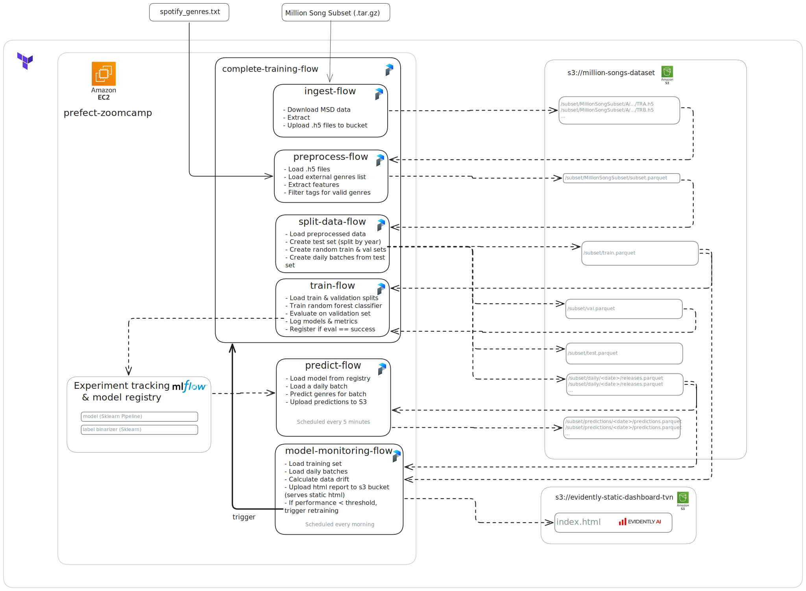

# genre-classifier-msd

This repository contains the code for the genre classifier task for the MLOps Zoomcamp course.
For more information, see the [MLOps Zoomcamp course repository](https://github.com/DataTalksClub/mlops-zoomcamp).

## Problem description

The task that I chose was to predict the genre of new music track releases based on certain features.
Imagine a music streaming service that wants to automatically tag new tracks with genres in order to improve
the user experience and recommendation system. Maybe the genre labels are not provided by the artists, or the service wants to add more granular tags to the tracks.

To do so, I used the [Million Song Dataset](http://millionsongdataset.com/), which contains metadata and a list of tags for each track.
The tags do not follow a set structure, and there are many different tags with varying quality.

Additionally, each track has a set of features extracted from the audio, such as tempo, key, loudness, etc.
These are provided by the [Echo Nest](https://the.echonest.com/) API, and an example of the track metadata can be found [here](http://millionsongdataset.com/pages/example-track-description/).

The task is a **multi-class**, **multi-label classification** task, i.e. for any track, any number of genres can be predicted.

## Stack

* Prefect: workflow orchestration (training, inference, monitoring)
  * Uses a Docker work pool
* sklearn: model training
* MLflow: experiment tracking & model registry
* Evidently AI: model monitoring
* Terraform: IaC
* AWS S3: storage
* AWS EC2: Prefect server & MLflow server host
* ruff: linter & code formatter
* poetry: dependency management
* Docker: containerization
* GitHub Actions: CI/CD
* pre-commit: git hooks
* pytest: unit tests & integration tests
* makefile: task automation

## Design



### Training pipeline

1. `ingest-data-flow`:
    * Load the Million Song Dataset subset.
    * Extract .h5 files for each track.
    * Upload the files to an S3 bucket (default: `subset/MillionSongSubset`).
2. `preprocess-flow`:
    * Load the .h5 files.
    * For each track, extract the features.
    * Load a separate file with a subset of valid genre tags and extract the genres from the metadata for each track.
    * Write the output to a single Parquet file (default: `subset/MillionSongSubset/subset.parquet`).
3. `split-data-flow`:
    * First, create a test set of tracks that will be used for inference.
      * The tracks with the latest release year are used for the test set.
      * The test set is further split into chunks and written to separate directories (default: `subset/daily`) in the S3 bucket to simulate a real-world scenario where new tracks are released each day.
    * Split the remaining tracks into a random training and validation set.
      * Write the train, validation and test sets to the S3 bucket as Parquet files (default: `subset/train.parquet`, `subset/val.parquet` and `subset/test.parquet`).
4. `train-flow`:
    * Load the training & validation sets.
    * Filter the genre labels to include only the top K genres (`top_k_genres` is a hyperparameter).
    * Fix outliers, apply feature normalization and impute missing values.
    * Train a random forest classifier (multi-label) and log it to MLflow.
    * Evaluate on the validation set and log the results to MLflow.
      * The main metrics are the jaccard score and the hamming loss.
    * If the metrics are better than some predefined thresholds, register the model in MLflow's model registry.

There is an additional flow, `complete-training-flow`, which calls the above training flows as subflows, chaining everything together.
If you want to train a model, it is recommended to use this flow, as it will ensure that all the steps are executed in the correct order.

### Prediction pipeline

The prediction service is deployed as a batch inference pipeline.
It is designed to simulate a real-world scenario where new tracks are released each day.
At every run, the pipeline will predict the genres for one day's worth of tracks.
To see immediate results for demo purposes, it is scheduled to run every 5 minutes, picking the data for a new day each time.

1. `predict-flow`:
    * Find a batch of tracks that hasn't been analysed yet.
    * Load the model from MLflow's model registry.
    * Predict the genres for each track.
    * Write the results to a Parquet file in the S3 bucket (default: `subset/predictions`).
2. `model-monitoring-flow`:
    * Load the predictions from the S3 bucket.
    * Calculate the model performance metrics.
    * Create an Evidently AI report and upload it to an S3 bucket that serves it as a static html page.
      * This bucket is created in Terraform and is named `evidently-static-dashboard-tvn` by default. To run it yourself, change the bucket name in [storage](terraform/storage.tf) and [create_s3_buckets.py](genre_classifier/blocks/create_s3_buckets.py).
      * The report is available at `http://evidently-static-dashboard-tvn.s3-website.eu-central-1.amazonaws.com/`, or `http://<BUCKET>.s3-website.<REGION>.amazonaws.com/report.html` if you changed the bucket name.
    * If the model performance is below some predefined thresholds, call the complete training pipeline as a subflow.

## Getting started

To run the code, you need to set up the infrastructure, initialize the local environment, connect to the Prefect & MLflow server, and deploy the flows.
It is very important to follow the below instructions carefully, as the flows are designed to work with the infrastructure set up by Terraform.

### Prerequisites

* [Terraform](https://developer.hashicorp.com/terraform/tutorials/aws-get-started/install-cli)
  * Note: on Mac M1, you need to create an amd64 environment, otherwise you will run into an error like "Template vX.Y.Z does not have a package available."
    ```bash
    brew uninstall terraform
    brew install tfenv
    TFENV_ARCH=amd64 tfenv install 1.9.3
    tfenv use 1.9.3
    ```
    Then, you can proceed with the instructions below.
* AWS account
* AWS credentials should be available in environment variables AWS_ACCESS_KEY_ID and AWS_SECRET_ACCESS_KEY, following the [AWS Terraform](https://developer.hashicorp.com/terraform/tutorials/aws-get-started/aws-build) instructions.
* Poetry should be installed, following the [installation instructions](https://python-poetry.org/docs/#installation).
* Docker
* An account on [docker hub](https://hub.docker.com/) - this can be created for free if you do not have one yet. Create a public repository, for example `yourusername/genre-classifier-train`. This is necessary to be able to deploy the flow by building a docker image and pulling it on the Prefect server.

### Set up infrastructure

Follow the instructions at [terraform/README.md](terraform/README.md) to set up the infrastructure using Terraform.

### Initialize local environment

To install the dependencies locally, run `make init`. This simply instructs poetry to use python 3.12 and installs packages from the poetry.lock file.

### Connecting to Prefect & MLflow

1. Update ~/.ssh/config with the following content:
    ```ssh-config
    Host prefect-zoomcamp
        HostName <IP>
        User ubuntu
        IdentityFile ~/.ssh/dev_key
        StrictHostKeyChecking no
    ```
2. Port forward the Prefect & MLflow server to your local machine by running `ssh -N -L 4200:localhost:4200 -L 5000:localhost:5000 prefect-zoomcamp`.
3. You should be able to access the Prefect UI through http://localhost:4200/dashboard, and the MLflow UI through http://localhost:5000.
4. Run `poetry run prefect config set PREFECT_API_URL="http://127.0.0.1:4200/api"` before executing flows.
5. Set the default work pool to the docker work pool: `poetry run prefect config set PREFECT_DEFAULT_WORK_POOL_NAME=docker-work-pool`


## Deploy

Update the `name` value inside the `DeploymentImage` at [deploy.py](./deploy.py) to point to your public repository. Otherwise you will not be able to build the image & pull it from the Prefect server.

To deploy the training & inference code, run `make deploy`. This will connect to the Prefect server, create the required AWS blocks, build the Docker container and deploy the Prefect flows.

Note: the bucket name may need to be customized if the name is already taken, you can do so by updating the `bucket_name` variable in [create_s3_buckets.py](genre_classifier/blocks/create_s3_buckets.py).

If everything is successful, you should see the following output:

```
Successfully created/updated all deployments!

                             Deployments
┏━━━━━━━━━━━━━━━━━━━━━━━━━━━━━━━━━━━━━━━━━━━━━━━━┳━━━━━━━━━┳━━━━━━━━━┓
┃ Name                                           ┃ Status  ┃ Details ┃
┡━━━━━━━━━━━━━━━━━━━━━━━━━━━━━━━━━━━━━━━━━━━━━━━━╇━━━━━━━━━╇━━━━━━━━━┩
│ ingest-flow/genre-classifier-ingest-v0         │ applied │         │
├────────────────────────────────────────────────┼─────────┼─────────┤
│ preprocess-flow/genre-classifier-preprocess-v0 │ applied │         │
├────────────────────────────────────────────────┼─────────┼─────────┤
│ split-data-flow/genre-classifier-split-data-v0 │ applied │         │
├────────────────────────────────────────────────┼─────────┼─────────┤
│ train-flow/genre-classifier-train-v0           │ applied │         │
├────────────────────────────────────────────────┼─────────┼─────────┤
│ complete-training-flow/complete-training-v0    │ applied │         │
├────────────────────────────────────────────────┼─────────┼─────────┤
│ model-monitoring-flow/model-monitoring-v0      │ applied │         │
├────────────────────────────────────────────────┼─────────┼─────────┤
│ predict-flow/genre-classifier-predict-v0       │ applied │         │
└────────────────────────────────────────────────┴─────────┴─────────┘

```

## Execute flows

### Train

First, execute the complete training run to train the model. This will run the ingest, preprocess, split data and train flows in sequence.
Open the Prefect UI at http://localhost:4200/flows and trigger the `complete-training-flow`. All parameters are set to default values, you only need to set the MLflow experiment name.

The experiment is tracked in MLflow, and you can view the results at http://localhost:5000. If the results of the training are good, the model will be registered in the model registry.

### Batch Inference

The inference pipeline is set to run every 5 minutes. View the runs in the Prefect UI at http://localhost:4200/flows.
The results are stored in the S3 bucket and can be viewed in the `subset/predictions` directory.

### Monitoring

The monitoring pipeline is set to run every morning. You can manually trigger it from the Prefect UI if you want to see the results immediately.
The flow is called `model-monitoring-flow`. The results are available at http://evidently-static-dashboard-tvn.s3-website.eu-central-1.amazonaws.com/index.html.

If the monitoring pipeline detects data drift, it will trigger the complete training pipeline to retrain the model.
To disable this behaviour, set the `trigger_retrain_if_needed` parameter to `False` in the `model-monitoring-flow`.

## Tests

To run unit tests, execute `make tests`. This will run the tests in the `tests` directory.
The integration tests can be run by executing `make integration_tests`. This requires the infrastructure to be set up, as it
writes some temporary files to a bucket called `million-songs-dataset-s3-cicd`.


## Cleanup

To clean up the infrastructure, run `make destroy`. This will destroy all the blocks created by Terraform.
